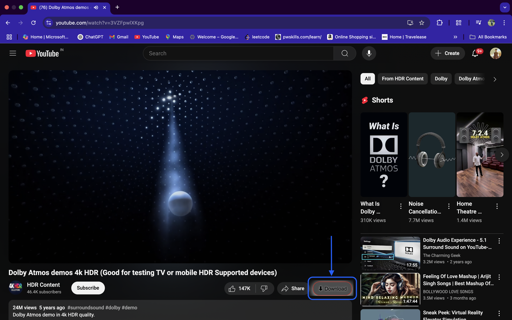
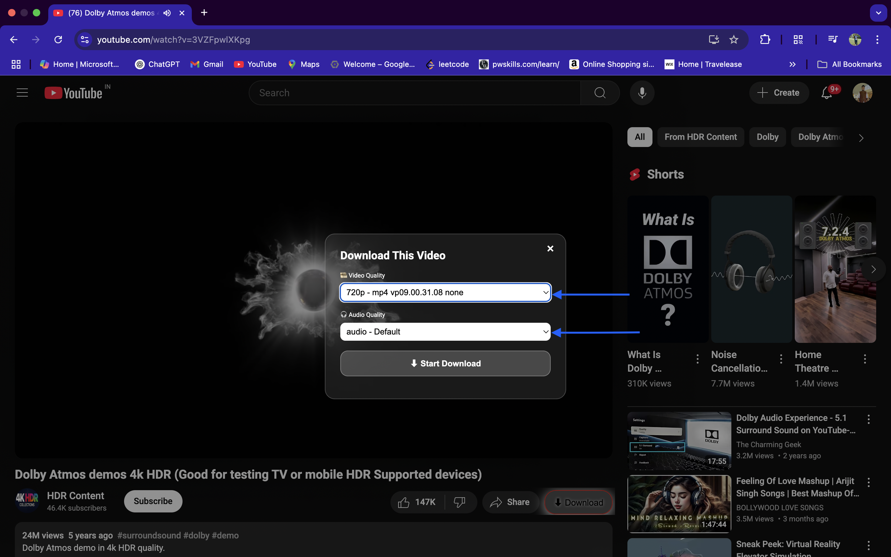
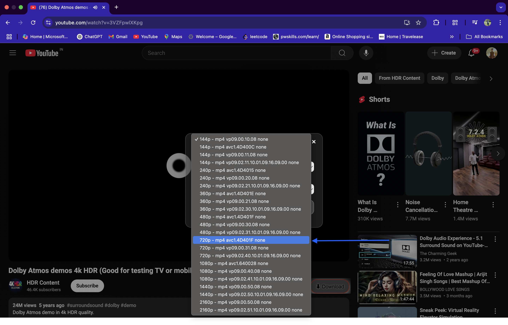
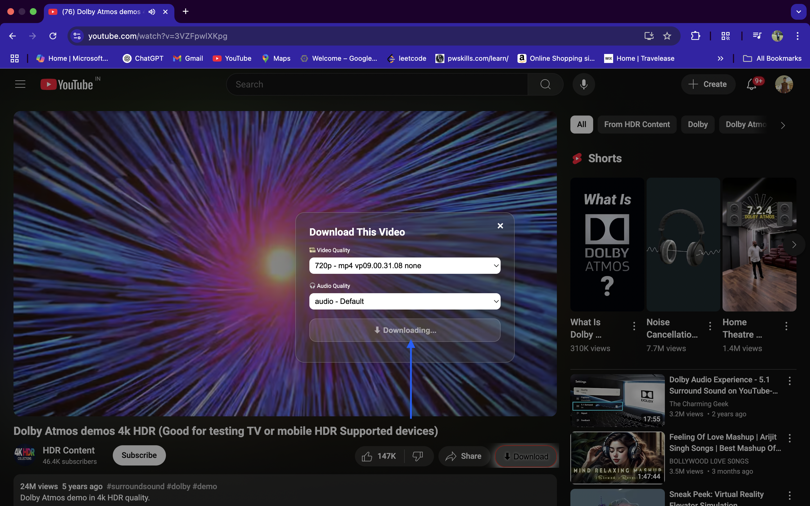
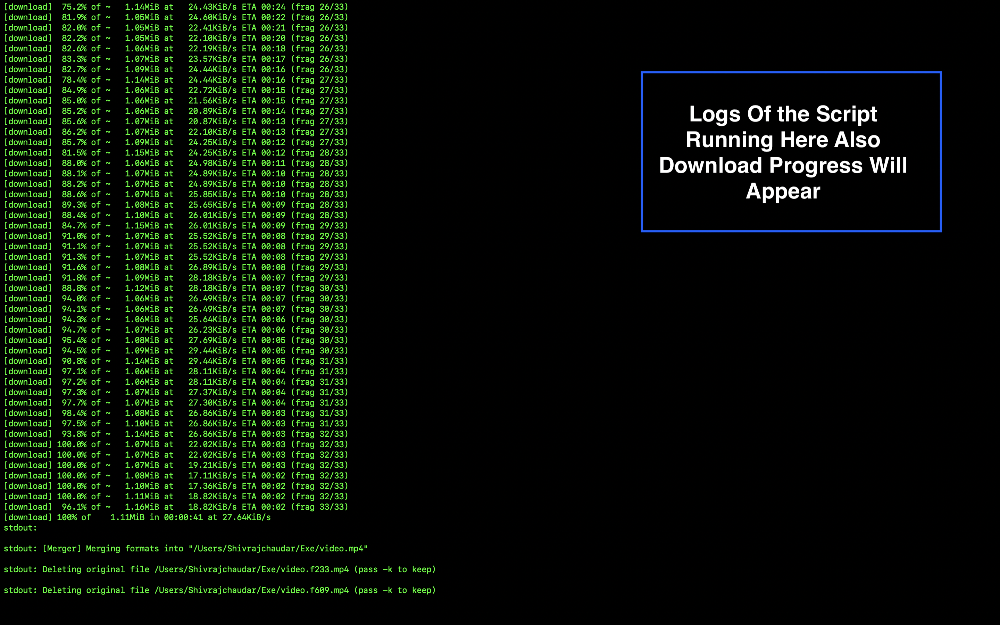

# 📥 YouTube Downloader Extension with Backend (yt-dlp + ffmpeg)

This project integrates a browser extension with a Node.js backend to enable downloading YouTube videos and Shorts via a clean UI. It uses `yt-dlp` to fetch and download video/audio formats and `ffmpeg` to merge them when necessary.

---

## 📁 Project Structure

| File                | Description                                     |
|---------------------|-------------------------------------------------|
| `content.js`        | Injects download button into YouTube UI         |
| `manifest.json`     | Chrome Extension configuration                  |
| `server.js`         | Node.js backend that calls `yt-dlp` + `ffmpeg`  |
| `package.json`      | NPM dependencies                                |
| `node_modules/`     | Installed Node dependencies                     |

---

## ⚙️ Prerequisites

You must install the following on your system:

- [Node.js](https://nodejs.org/)
- [yt-dlp](https://github.com/yt-dlp/yt-dlp)
- [ffmpeg](https://ffmpeg.org/)

---

## 🧩 Step 1: Install Node Dependencies

```bash
npm install
```

🛠️ Step 2: Install yt-dlp and ffmpeg

🔵 macOS (with Homebrew)

```
brew install yt-dlp ffmpeg
```

🟢 Ubuntu/Debian

```
sudo apt update
sudo apt install yt-dlp ffmpeg
```

🟣 Windows  
Option 1: Using Scoop

```
scoop install yt-dlp ffmpeg
```

Option 2: Manual Setup  
1. Download yt-dlp.exe from yt-dlp GitHub releases  
2. Download FFmpeg from https://ffmpeg.org/download.html  
3. Extract and add both to your System PATH

🚀 Step 3: Start the Backend Server  
Run the server in terminal:

```
node server.js
```

The backend will start at:  
http://localhost:3000

🌐 Step 4: Load the Chrome Extension  
1. Open Chrome and visit chrome://extensions/  
2. Enable Developer Mode (top right)  
3. Click Load unpacked  
4. Select the folder containing manifest.json and content.js

🎬 Step 5: Use the Extension  
1. Open any YouTube video or Short  
2. Click the newly injected ⬇ Download button  
3. A modal appears showing available video/audio formats  
4. Choose your format(s) and click Start Download  
5. The backend downloads and returns the file to your browser

⚙️ How It Works  
• Frontend (content.js):  
• Injects a “Download” button next to YouTube video controls  
• On click, shows a modal UI  
• Fetches available video/audio formats only when modal opens  

• Backend (server.js):  
• Provides /api/formats endpoint to list formats using yt-dlp  
• Provides /api/download endpoint to fetch selected video/audio  
• Merges streams using ffmpeg if both video and audio selected  
• Returns .mp4 as a downloadable blob

🧠 Troubleshooting

| Problem             | Solution                                        |
|---------------------|-------------------------------------------------|
| Button not visible  | Reload page or confirm you’re on a video/short |
| Download fails      | Ensure server.js is running properly            |
| yt-dlp not found    | Confirm it is installed and available in PATH   |
| ffmpeg errors       | Make sure ffmpeg is installed and working       |
| CORS error          | Disable browser CORS security (dev-only, unsafe)|

✅ Compatibility

| OS      | Extension | yt-dlp | ffmpeg |
|---------|-----------|--------|--------|
| macOS   | ✅         | ✅      | ✅      |
| Windows | ✅         | ✅      | ✅      |
| Linux   | ✅         | ✅      | ✅      |

⚠️ Disclaimer

This project is for educational and personal use only.  
Downloading copyrighted material may violate YouTube’s terms of service or local copyright laws.

---

## 👨‍💻 Author

**Shivraj Chaudar**  
GitHub: [@rajchaudar](https://github.com/rajchaudar)

---

## 📸 Screenshots

```markdown





```

---

## 📬 Got Issues?

Open an issue or pull request at:  
👉 [https://github.com/rajchaudar](https://github.com/rajchaudar)